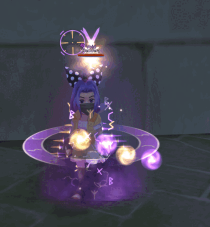

# ROSE Online — Cosmetic Mods

Client-side cosmetic mods for ROSE Online. Interface recolors, combat text, loot beams, and
an expanded Friends window. **Nothing here touches the server, your account, or any game
logic.**

---

## What's here

| | | |
|---|---|---|
| **[Void Halloween](docs/halloween.md)** | eight seasonal packs: spooky interface, effects, drops | *new* |
| **[UI Themes](docs/ui-themes.md)** | four complete interface recolors, cursors and all | 4 packs |
| **[Combat Text](docs/combat-text.md)** | the floating damage numbers, on their own | 8 packs |
| **[Loot Beams](docs/loot-beams.md)** | a beam over drops worth stopping for, and a new model for each | 11 groups |
| **[Potion Beams](docs/potion-beams.md)** | the potion flask and its beam | 6 colours |
| **[Buff Effects](docs/buffs.md)** | nine buff auras, each with its own silhouette | 9 buffs |
| **[Buff Icons](docs/buff-icons.md)** | icons coloured by the class that casts them | 1 pack |
| **[Community Window](docs/community-window.md)** | your Friends window with notes, a checklist and symbols | 1 pack |

**[Installing](docs/installing.md)** · **[Is this safe?](docs/installing.md#is-this-safe)** ·
**[Modding notes](docs/modding-notes.md)** · [every file in every pack](packs/CONTENTS.md) ·
[checksums](CHECKSUMS.txt)

---

## The interface

Four complete recolors -- window frames, buttons, tabs, chat box, minimap ring, cursors,
gauges and combat text. [See all four](docs/ui-themes.md)

## The drops

Eleven drop groups, six colours each, every one independent -- so you can have teal crystals
and red ore if you want. [Pick your colours](docs/loot-beams.md)

## The buffs

Nine auras, each a distinct shape rather than another coloured glow, so you can read them at
a glance in a crowded fight. [See each one](docs/buffs.md)

---

## Installing, in short

Close the game, copy the folders from the zip into your ROSE Online folder letting them merge,
start the game. To remove: delete the files you copied in. Nothing here is an installer, and
nothing in the archives can run -- [the full explanation is here](docs/installing.md).

## Terms

Free to use. Please don't sell it or repackage it as your own. Credit is appreciated but not
required. These are recolors of ROSE Online's own artwork plus original work by me; all rights
in the underlying game assets belong to their owners.
