# ROSE Online — Cosmetic Mods

Client-side cosmetic mods for ROSE Online. Interface recolors, combat text, loot beams, and
an expanded Friends window. **Nothing here touches the server, your account, or any game
logic.**

---

## UI Themes

Four complete interface recolors — window frames, buttons, tabs, chat box, minimap ring,
cursors, gauges, and combat text.

| Theme | Look |
|---|---|
| **Void** | purple and violet chrome, magenta clan accent — the original |
| **Crimson** | near-black glass, deep blood-red glow, bone-white rim, amber alerts |
| **Moldie** | royal blue chrome, hat-gold highlights |
| **Ancient** | slate verdigris chrome, copper highlights, clay and steel gauges |

Component breakdown, and all four in game

**Download:**
[Void](../../releases/latest/download/ROSE_UI_Void.zip) ·
[Crimson](../../releases/latest/download/ROSE_UI_Crimson.zip) ·
[Moldie](../../releases/latest/download/ROSE_UI_Moldie.zip) ·
[Ancient](../../releases/latest/download/ROSE_UI_Ancient.zip)

Potion colors are **not** included in the theme packs — they're separate below, so you can
mix and match rather than having a color forced on you.

---

## Combat Text (standalone)

Just the floating combat numbers, for anyone who wants a clearer damage readout without
changing their whole interface. 13 files.

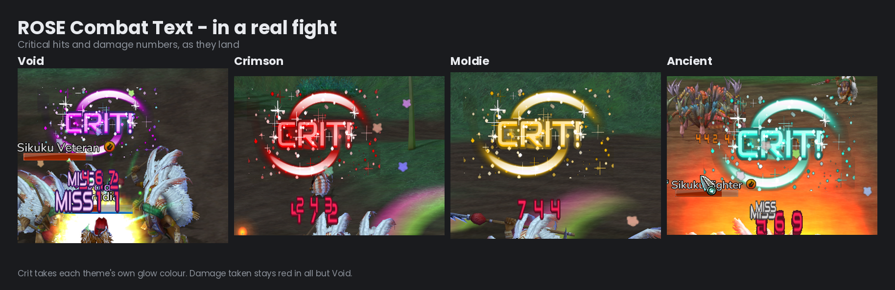

**Download:**
[Void](../../releases/latest/download/ROSE_CombatText_Void.zip) ·
[Crimson](../../releases/latest/download/ROSE_CombatText_Crimson.zip) ·
[Moldie](../../releases/latest/download/ROSE_CombatText_Moldie.zip) ·
[Ancient](../../releases/latest/download/ROSE_CombatText_Ancient.zip)

### Large

The same four themes with the numbers drawn as large as the game allows — about **36% taller**.

The original artwork leaves roughly a third of each number's space empty, so at any distance
you're reading smaller digits than you need to be. This fills that space. Same colors, same
behaviour, same everything else.

[Void](../../releases/latest/download/ROSE_CombatText_Void_Large.zip) ·
[Crimson](../../releases/latest/download/ROSE_CombatText_Crimson_Large.zip) ·
[Moldie](../../releases/latest/download/ROSE_CombatText_Moldie_Large.zip) ·
[Ancient](../../releases/latest/download/ROSE_CombatText_Ancient_Large.zip)

The size the game draws these at lives in the effect definition, which a mod can't reach — so
36% is the whole of what the artwork can give. The digits now stop one pixel short of their
neighbours; any larger and they'd run together.

Damage types are told apart by color, so each one is assigned rather than everything being
tinted the same way:

- **damage you deal** — the theme's color
- **damage you take** — red
- **healing** — green
- **critical hits** — matches the theme's glow
- **blocked / absorbed** — muted variants
- **miss** — neutral grey

In **Crimson, Moldie and Ancient**, damage taken and healing are **identical** — they never
change between themes, so you don't have to relearn your own combat log when you switch.

**Void is the exception.** It was made before I settled on that rule, so its whole set sits in
the violet/magenta family — healing reads blue, received damage reads magenta. It suits the
Void interface, but if you want the clearest readout, one of the other three is the better
pick.

*Already running a full UI theme? You don't need this — the combat text is included in it.*

---

## Potion Beams

Recolors of the potion flask and the light beam it casts. Two files each — the recolored
texture, and the beam mesh, which is my own work built from scratch. Works with any UI theme,
or with none.

This was the first one. The other drop groups are under [Loot Beams](#loot-beams) below, and
they all share the same beam.

The flask and beam artwork on its own

**Download:**
[Void](../../releases/latest/download/ROSE_Potion_Void.zip) ·
[Crimson](../../releases/latest/download/ROSE_Potion_Crimson.zip) ·
[Moldie](../../releases/latest/download/ROSE_Potion_Moldie.zip) ·
[Verdigris](../../releases/latest/download/ROSE_Potion_Verdigris.zip) ·
[Lime](../../releases/latest/download/ROSE_Potion_Lime.zip) ·
[Chem](../../releases/latest/download/ROSE_Potion_Chem.zip)

---

## Loot Beams

A tall beam of light over the drops worth stopping for, plus a new model for the drop
itself so you can tell at a glance *what* you're looking at, not just that something's there.

Six drop groups, six colors each. Every category is independent — mix and match freely.
Install one color per category.

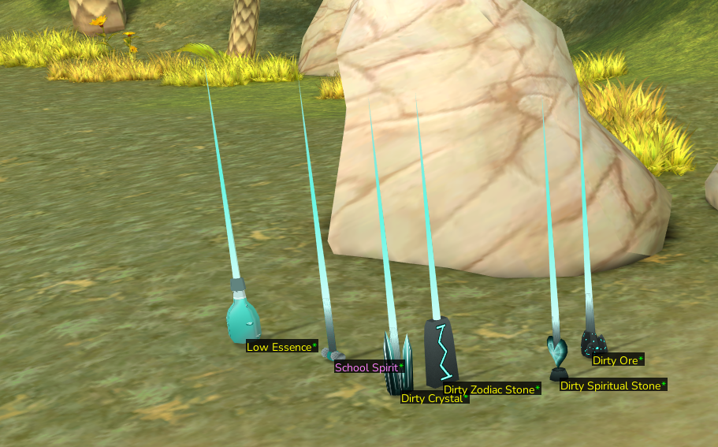

Two files per pack: the texture, and the mesh. The mesh is my own work, built from scratch,
and the beam will not render without it — install both. The beam itself is pixel-identical
across every category and color, so the whole set reads as one thing.

### Want everything one color?

One download instead of eleven. Each bundle is every drop group in that color — the same files
as the individual packs, just in one archive.

[**Void**](../../releases/latest/download/ROSE_AllBeams_Void.zip) ·
[**Crimson**](../../releases/latest/download/ROSE_AllBeams_Crimson.zip) ·
[**Verdigris**](../../releases/latest/download/ROSE_AllBeams_Verdigris.zip) ·
[**Moldie**](../../releases/latest/download/ROSE_AllBeams_Moldie.zip) ·
[**Lime**](../../releases/latest/download/ROSE_AllBeams_Lime.zip)

[**Themed**](../../releases/latest/download/ROSE_AllBeams_Themed.zip) — every drop group in the
color of its own original artwork. Chem, Rune, Quartz, Copper, Prism, Sunflower, Parchment,
Kraft, Jade, Bronze, Silver and Linen together. For anyone who wants drops visible without
changing how the game looks.

Prefer to mix — teal crystals but red ore? Use the individual packs below.

### Hard to see? Double size

Every complete set again with all the models at **200%**. Made for anyone who finds the normal
size difficult to pick out; it's the same artwork, just larger.

[Void](../../releases/latest/download/ROSE_AllBeams_Void_x2.zip) ·
[Crimson](../../releases/latest/download/ROSE_AllBeams_Crimson_x2.zip) ·
[Verdigris](../../releases/latest/download/ROSE_AllBeams_Verdigris_x2.zip) ·
[Moldie](../../releases/latest/download/ROSE_AllBeams_Moldie_x2.zip) ·
[Lime](../../releases/latest/download/ROSE_AllBeams_Lime_x2.zip) ·
[Themed](../../releases/latest/download/ROSE_AllBeams_Themed_x2.zip)

Same filenames as the normal sets, so installing one over the other swaps them cleanly. If you
need something these don't cover, ask — it's no trouble.

### Zodiac & Rune Stone

A carved standing stone with a glowing rune on both faces.
*Dirty Zodiac Stone · Dirty Rune Stone*

| Void | Crimson | Verdigris | Moldie | Lime | Rune |
|---|---|---|---|---|---|
| 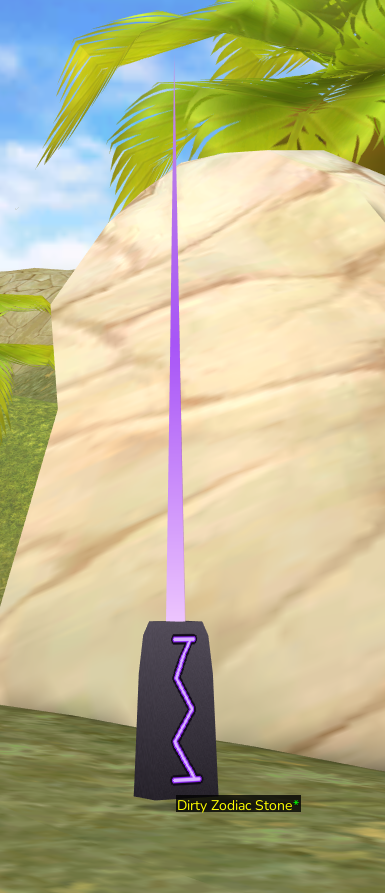 | 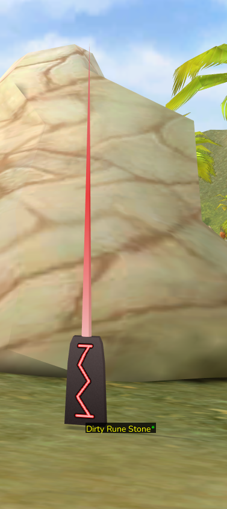 | 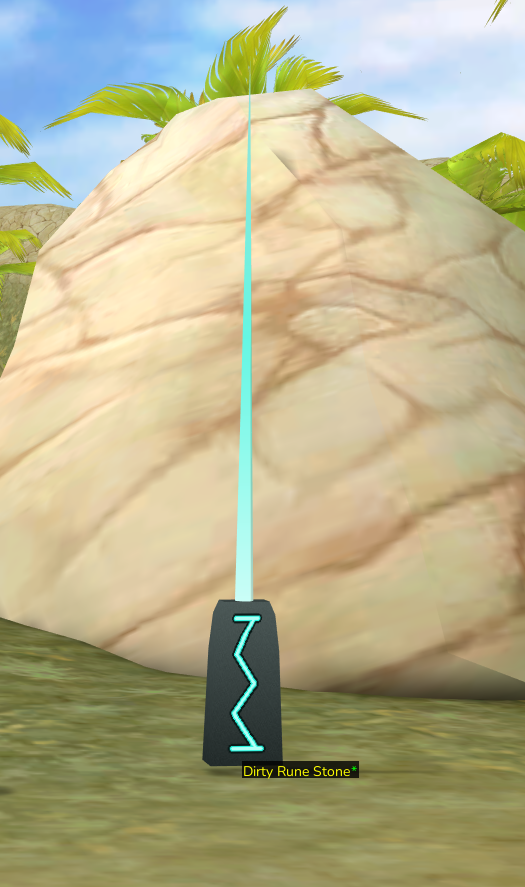 | 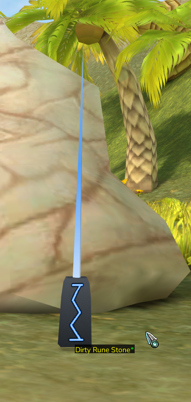 | 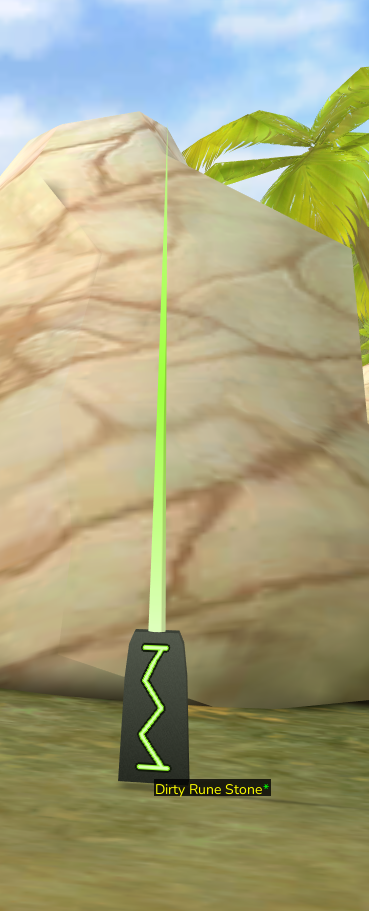 | 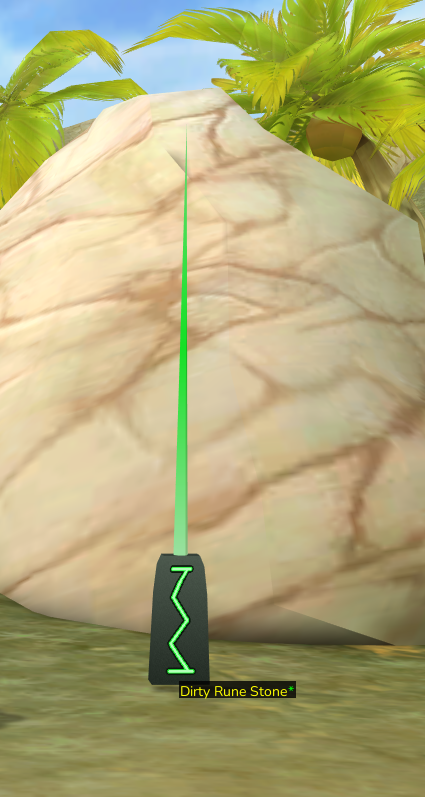 |

[Void](../../releases/latest/download/ROSE_DI22_Void.zip) ·
[Crimson](../../releases/latest/download/ROSE_DI22_Crimson.zip) ·
[Verdigris](../../releases/latest/download/ROSE_DI22_Verdigris.zip) ·
[Moldie](../../releases/latest/download/ROSE_DI22_Moldie.zip) ·
[Lime](../../releases/latest/download/ROSE_DI22_Lime.zip) ·
[Rune](../../releases/latest/download/ROSE_DI22_Rune.zip)

### Dirty Crystal

A cluster of cut crystal shards, with the beam rising from the middle of them.
*Dirty Crystal*

| Void | Crimson | Verdigris | Moldie | Lime | Quartz |
|---|---|---|---|---|---|
| 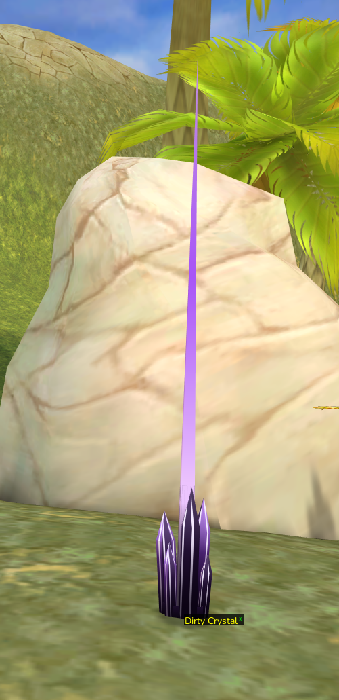 | 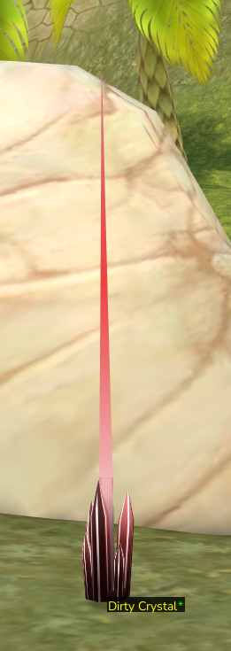 | 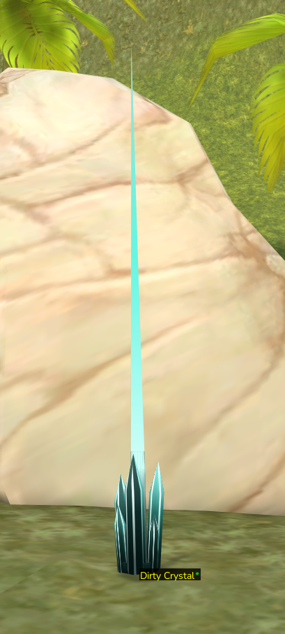 | 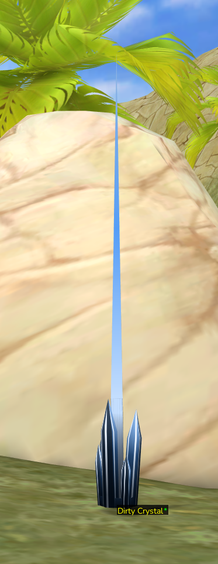 | 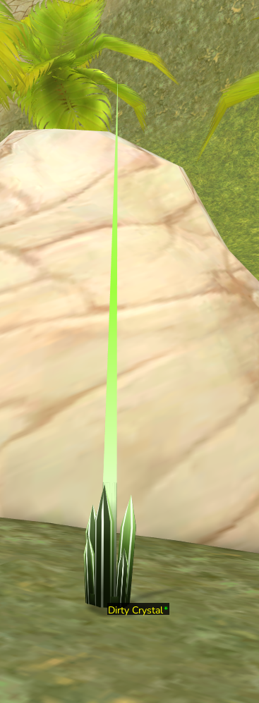 | 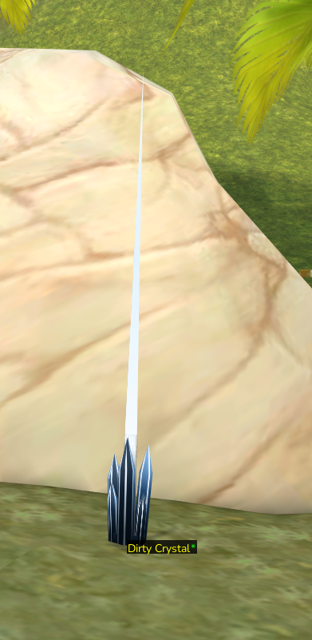 |

[Void](../../releases/latest/download/ROSE_DI23_Void.zip) ·
[Crimson](../../releases/latest/download/ROSE_DI23_Crimson.zip) ·
[Verdigris](../../releases/latest/download/ROSE_DI23_Verdigris.zip) ·
[Moldie](../../releases/latest/download/ROSE_DI23_Moldie.zip) ·
[Lime](../../releases/latest/download/ROSE_DI23_Lime.zip) ·
[Quartz](../../releases/latest/download/ROSE_DI23_Quartz.zip)

### Dirty Ore & Dirty Stone

Broken rock veined with glowing ore.
*Dirty Ore · Dirty Stone*

| Void | Crimson | Verdigris | Moldie | Lime | Copper |
|---|---|---|---|---|---|
| 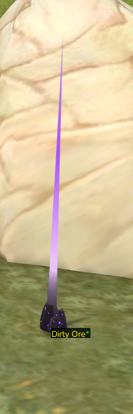 | 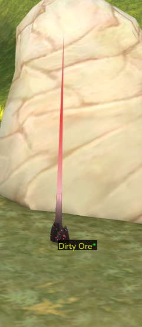 | 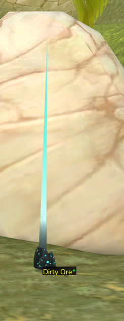 | 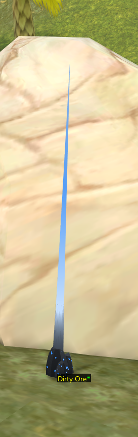 | 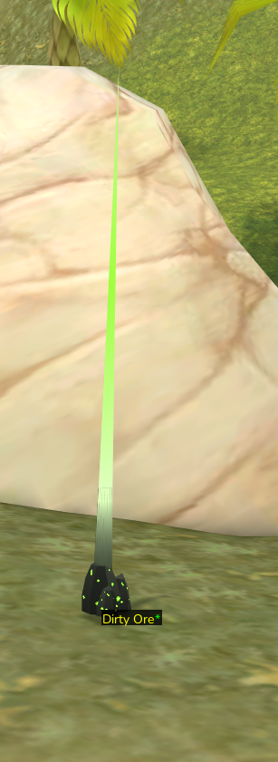 | 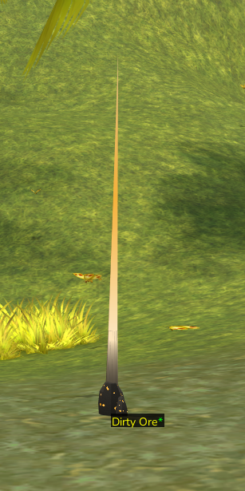 |

[Void](../../releases/latest/download/ROSE_DI55_Void.zip) ·
[Crimson](../../releases/latest/download/ROSE_DI55_Crimson.zip) ·
[Verdigris](../../releases/latest/download/ROSE_DI55_Verdigris.zip) ·
[Moldie](../../releases/latest/download/ROSE_DI55_Moldie.zip) ·
[Lime](../../releases/latest/download/ROSE_DI55_Lime.zip) ·
[Copper](../../releases/latest/download/ROSE_DI55_Copper.zip)

### Spiritual & Heart Stone

A faceted gemstone heart on a small pedestal. The **Prism** version keeps the rainbow of
the original artwork — every facet a different hue, and the beam sweeps through the
spectrum as it rises.
*Dirty Spiritual Stone · Dirty Heart Stone*

| Void | Crimson | Verdigris | Moldie | Lime | Prism |
|---|---|---|---|---|---|
| 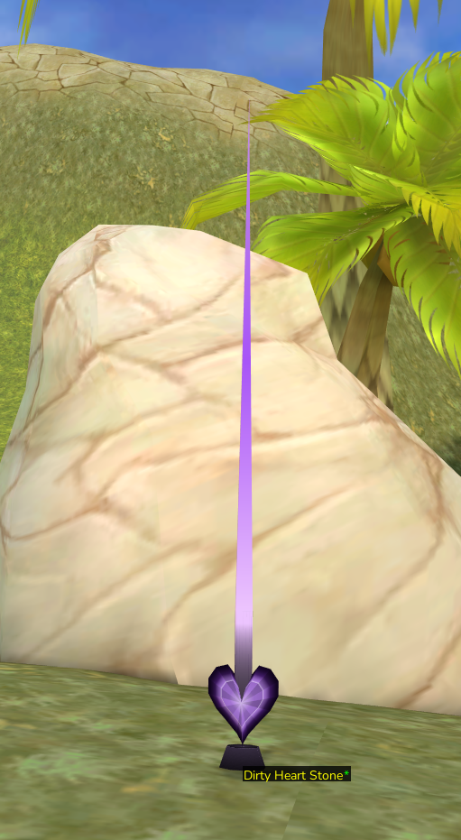 | 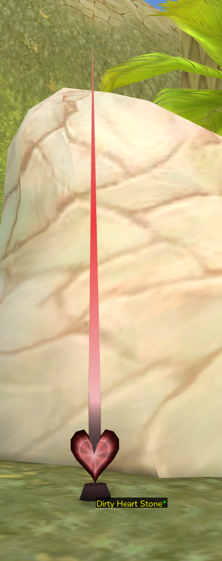 | 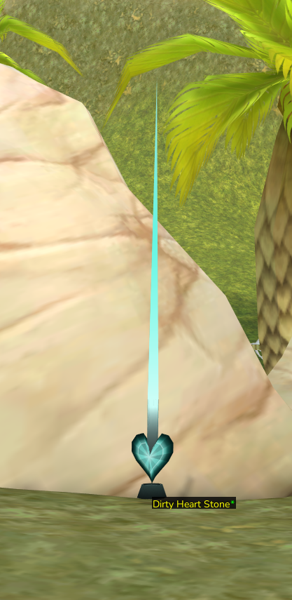 | 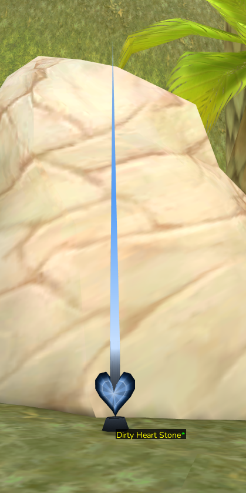 | 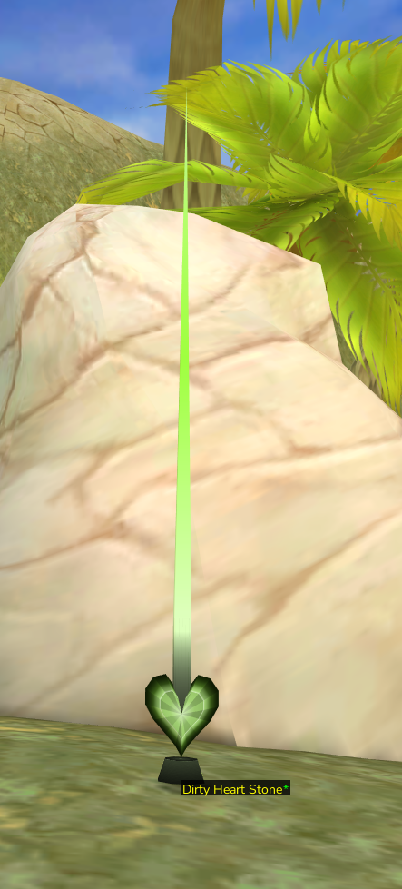 | 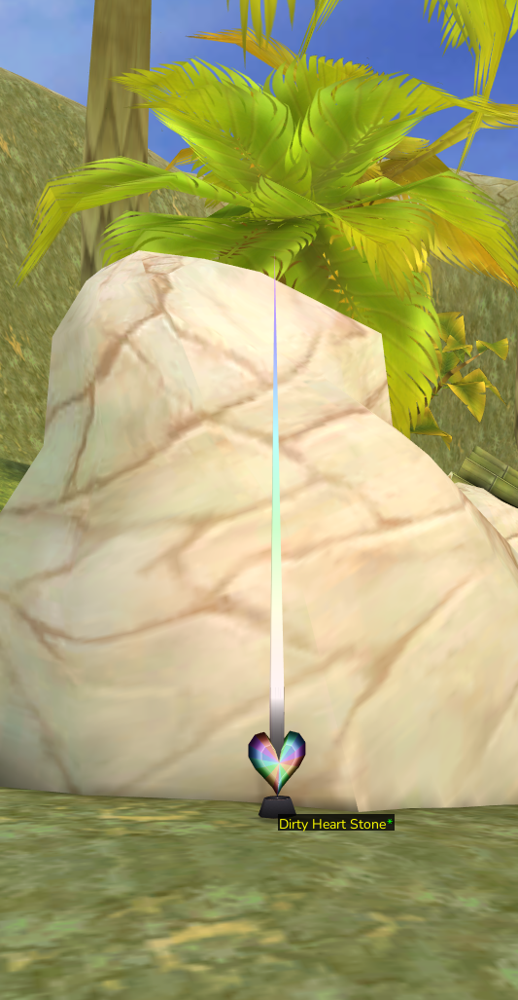 |

[Void](../../releases/latest/download/ROSE_DI10_Void.zip) ·
[Crimson](../../releases/latest/download/ROSE_DI10_Crimson.zip) ·
[Verdigris](../../releases/latest/download/ROSE_DI10_Verdigris.zip) ·
[Moldie](../../releases/latest/download/ROSE_DI10_Moldie.zip) ·
[Lime](../../releases/latest/download/ROSE_DI10_Lime.zip) ·
[Prism](../../releases/latest/download/ROSE_DI10_Prism.zip)

### Scrolls & Event Drops

A bound roll of parchment. The paper takes the color lightly, the cord takes it fully.
*Scrolls, dances, and event items — including this event's School Spirit.*

| Void | Crimson | Verdigris | Moldie | Lime | Parchment |
|---|---|---|---|---|---|
| 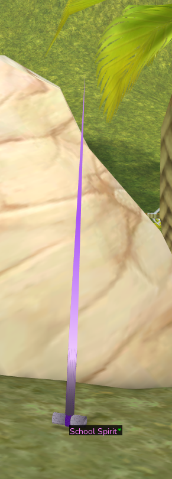 | 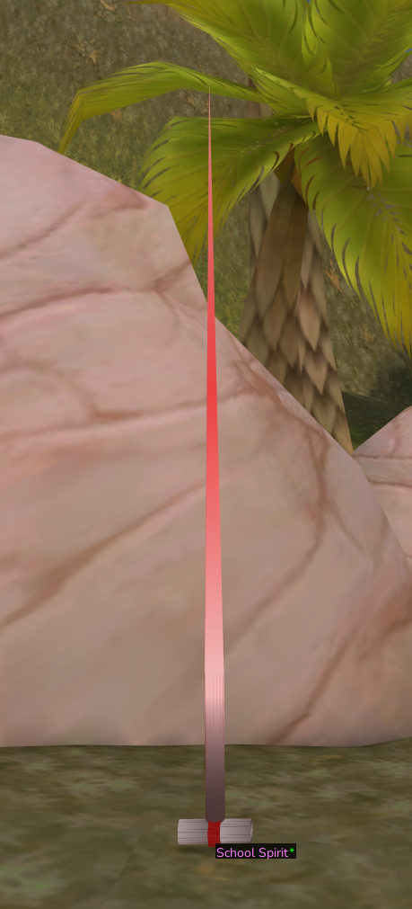 | 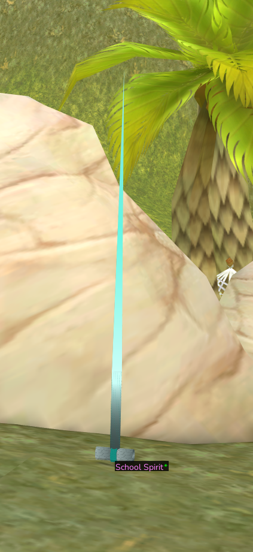 | 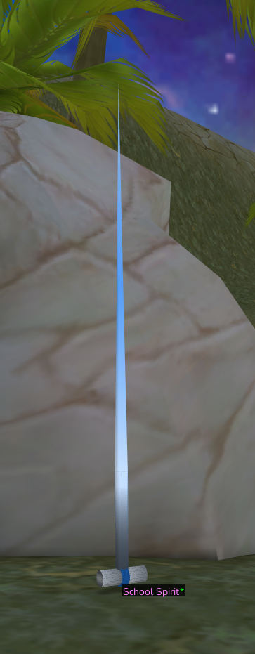 | 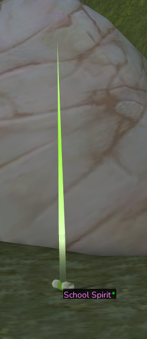 | 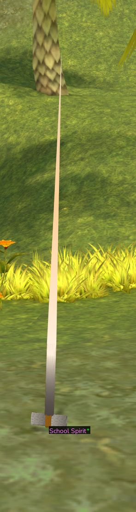 |

[Void](../../releases/latest/download/ROSE_DI50_Void.zip) ·
[Crimson](../../releases/latest/download/ROSE_DI50_Crimson.zip) ·
[Verdigris](../../releases/latest/download/ROSE_DI50_Verdigris.zip) ·
[Moldie](../../releases/latest/download/ROSE_DI50_Moldie.zip) ·
[Lime](../../releases/latest/download/ROSE_DI50_Lime.zip) ·
[Parchment](../../releases/latest/download/ROSE_DI50_Parchment.zip)

### Clan Points

A plasma wisp floating over a scorched patch of ground.
*Clan point drops*

| Void | Crimson | Verdigris | Moldie | Lime | Sunflower |
|---|---|---|---|---|---|
| 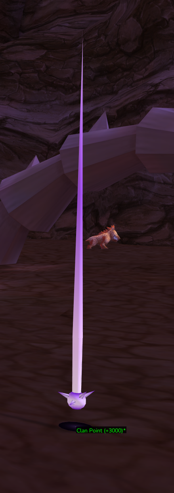 | 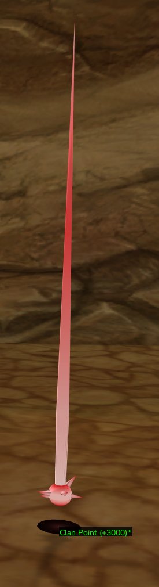 | 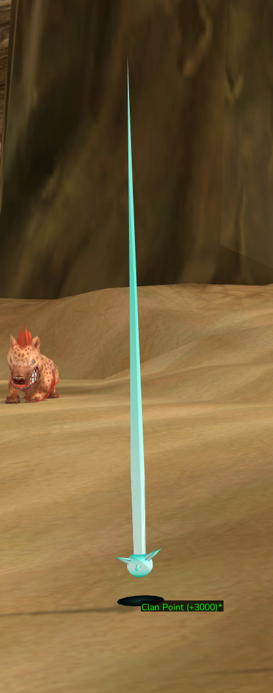 | 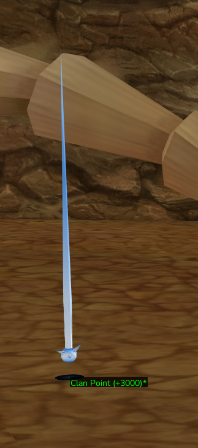 | 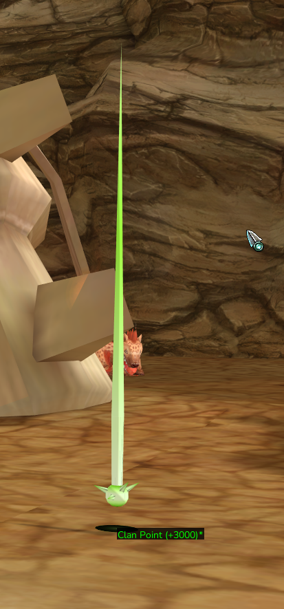 | 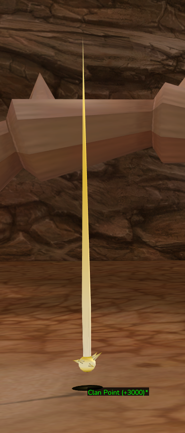 |

[Void](../../releases/latest/download/ROSE_DI46_Void.zip) ·
[Crimson](../../releases/latest/download/ROSE_DI46_Crimson.zip) ·
[Verdigris](../../releases/latest/download/ROSE_DI46_Verdigris.zip) ·
[Moldie](../../releases/latest/download/ROSE_DI46_Moldie.zip) ·
[Lime](../../releases/latest/download/ROSE_DI46_Lime.zip) ·
[Sunflower](../../releases/latest/download/ROSE_DI46_Sunflower.zip)

### Mounts

A wrapped present with a ribbon and bow. Getting a mount should feel like something.
*Mounts. A few other items share this drop group and will use it too.*

| Void | Crimson | Verdigris | Moldie | Lime | Kraft |
|---|---|---|---|---|---|
| 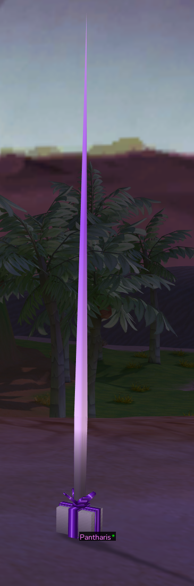 | 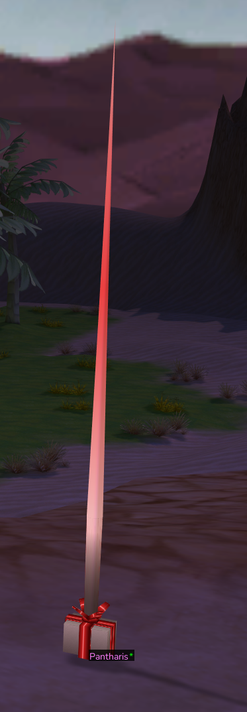 | 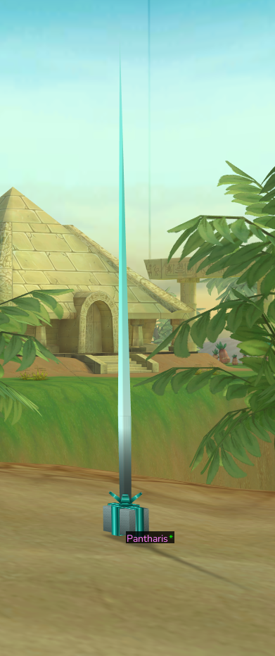 | 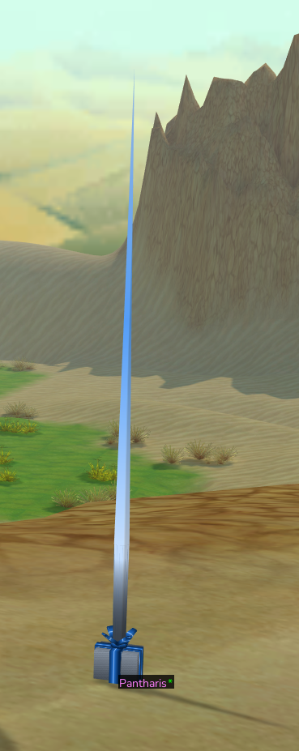 | 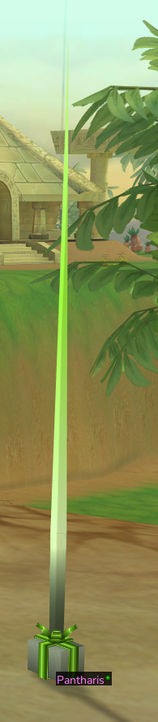 | 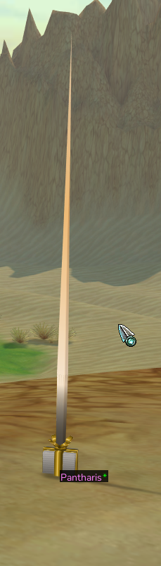 |

[Void](../../releases/latest/download/ROSE_DI52_Void.zip) ·
[Crimson](../../releases/latest/download/ROSE_DI52_Crimson.zip) ·
[Verdigris](../../releases/latest/download/ROSE_DI52_Verdigris.zip) ·
[Moldie](../../releases/latest/download/ROSE_DI52_Moldie.zip) ·
[Lime](../../releases/latest/download/ROSE_DI52_Lime.zip) ·
[Kraft](../../releases/latest/download/ROSE_DI52_Kraft.zip)

### Boss Gems

A large cut stone held in a claw setting. Covers all four gem types.
*King Gem and the other boss gems*

| Void | Crimson | Verdigris | Moldie | Lime | Jade |
|---|---|---|---|---|---|
| 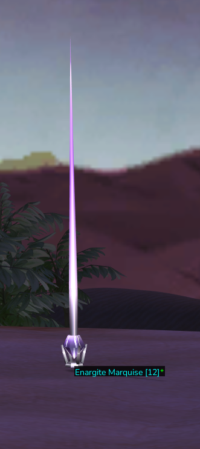 | 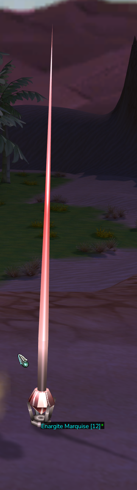 | 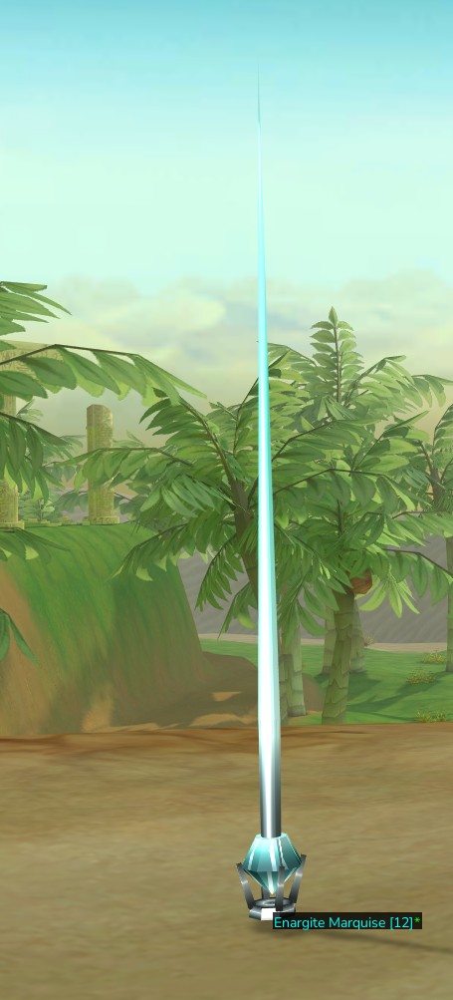 | 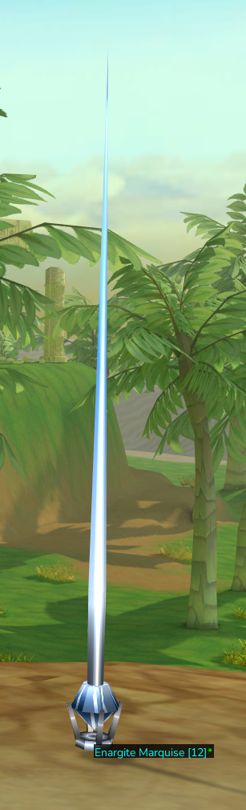 | 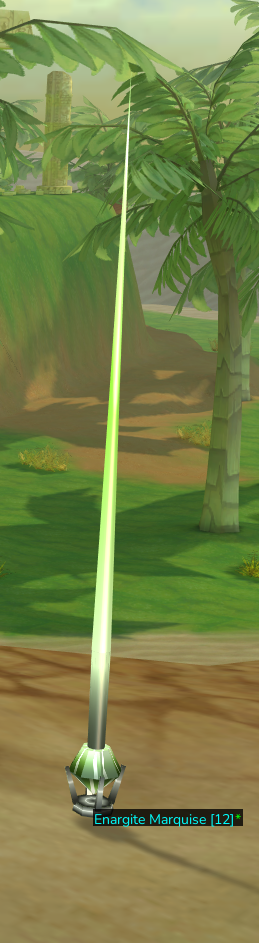 | 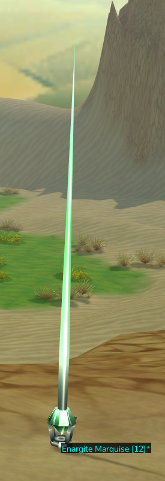 |

[Void](../../releases/latest/download/ROSE_GEM_Void.zip) ·
[Crimson](../../releases/latest/download/ROSE_GEM_Crimson.zip) ·
[Verdigris](../../releases/latest/download/ROSE_GEM_Verdigris.zip) ·
[Moldie](../../releases/latest/download/ROSE_GEM_Moldie.zip) ·
[Lime](../../releases/latest/download/ROSE_GEM_Lime.zip) ·
[Jade](../../releases/latest/download/ROSE_GEM_Jade.zip)

### Effigies

A carved idol on a plinth, bound with a ritual cord, with an offering bowl on top. Four different faces up the stack.
*Boss summon effigies*

| Void | Crimson | Verdigris | Moldie | Lime | Bronze |
|---|---|---|---|---|---|
| 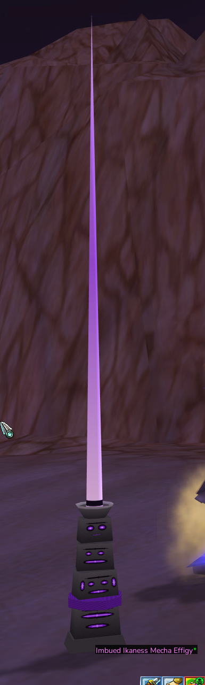 | 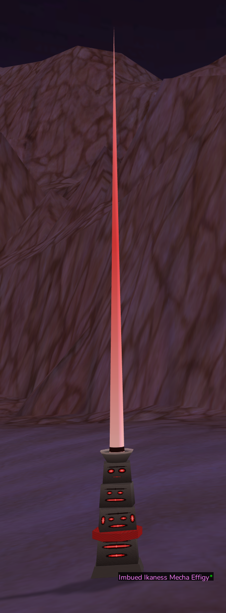 | 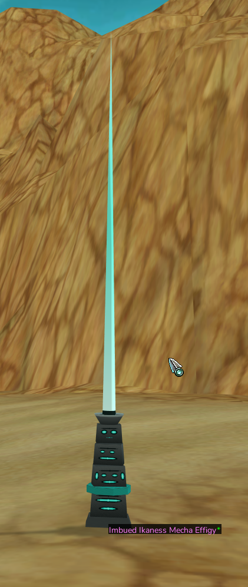 | 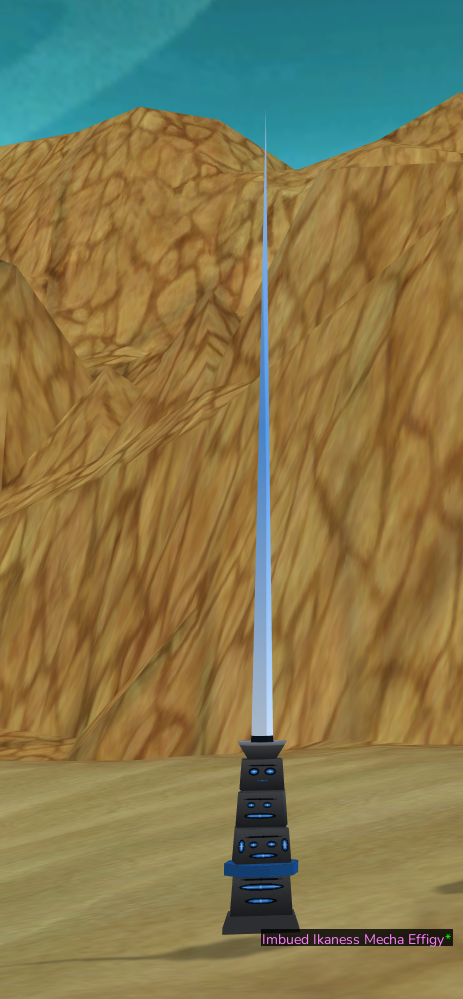 | 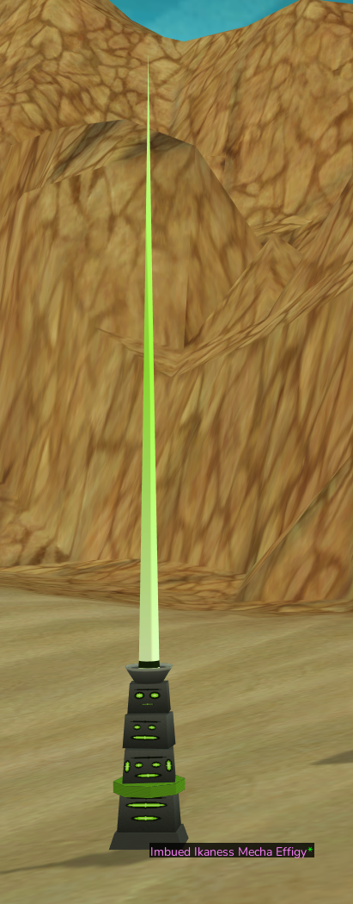 | 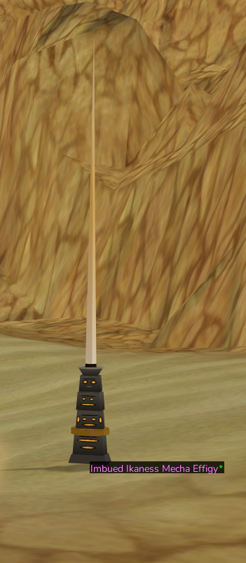 |

[Void](../../releases/latest/download/ROSE_TOTEM_Void.zip) ·
[Crimson](../../releases/latest/download/ROSE_TOTEM_Crimson.zip) ·
[Verdigris](../../releases/latest/download/ROSE_TOTEM_Verdigris.zip) ·
[Moldie](../../releases/latest/download/ROSE_TOTEM_Moldie.zip) ·
[Lime](../../releases/latest/download/ROSE_TOTEM_Lime.zip) ·
[Bronze](../../releases/latest/download/ROSE_TOTEM_Bronze.zip)

### Rings, Necklaces & Earrings

A band standing on edge with a set stone at the top. All three accessory types share one model in the game, so they share this one.
*Rings, necklaces, earrings*

| Void | Crimson | Verdigris | Moldie | Lime | Silver |
|---|---|---|---|---|---|
| 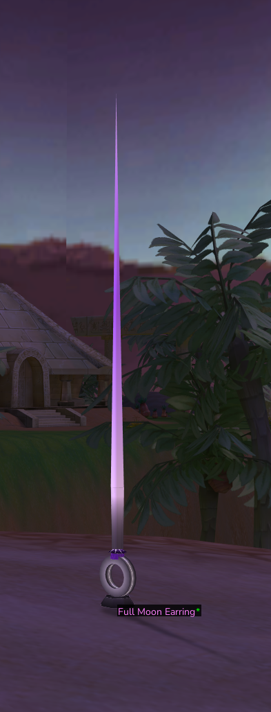 | 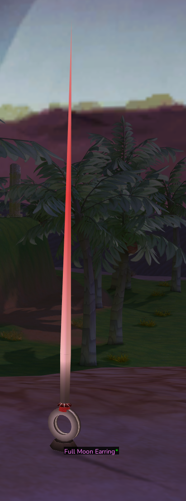 | 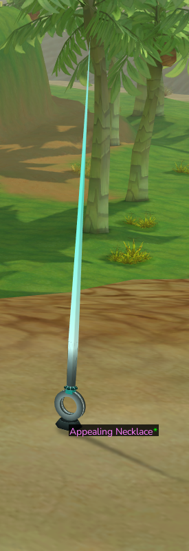 | 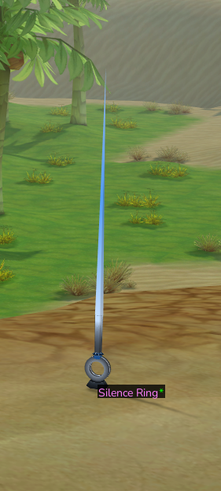 | 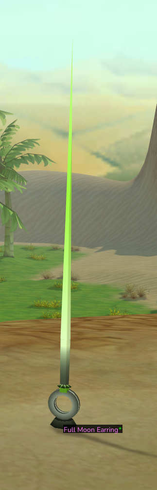 | 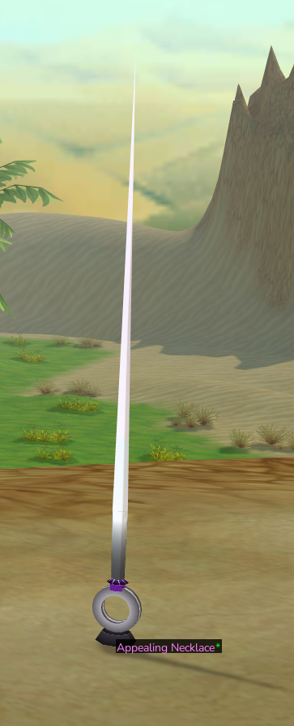 |

[Void](../../releases/latest/download/ROSE_JEWEL_Void.zip) ·
[Crimson](../../releases/latest/download/ROSE_JEWEL_Crimson.zip) ·
[Verdigris](../../releases/latest/download/ROSE_JEWEL_Verdigris.zip) ·
[Moldie](../../releases/latest/download/ROSE_JEWEL_Moldie.zip) ·
[Lime](../../releases/latest/download/ROSE_JEWEL_Lime.zip) ·
[Silver](../../releases/latest/download/ROSE_JEWEL_Silver.zip)

### Talismans & Powders

A drawstring charm pouch, gathered at the neck and embroidered all the way round. A bag of runestones makes more sense of the contents than one carved slab.
*Talismans, Lisents, Scarabs, powders — and refine materials, so expect plenty of these*

| Void | Crimson | Verdigris | Moldie | Lime | Linen |
|---|---|---|---|---|---|
| 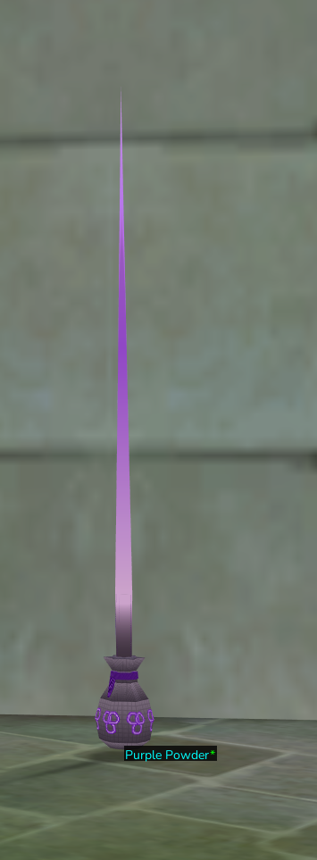 | 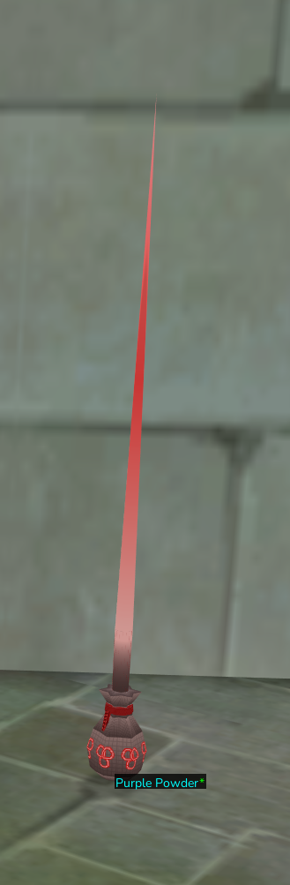 | 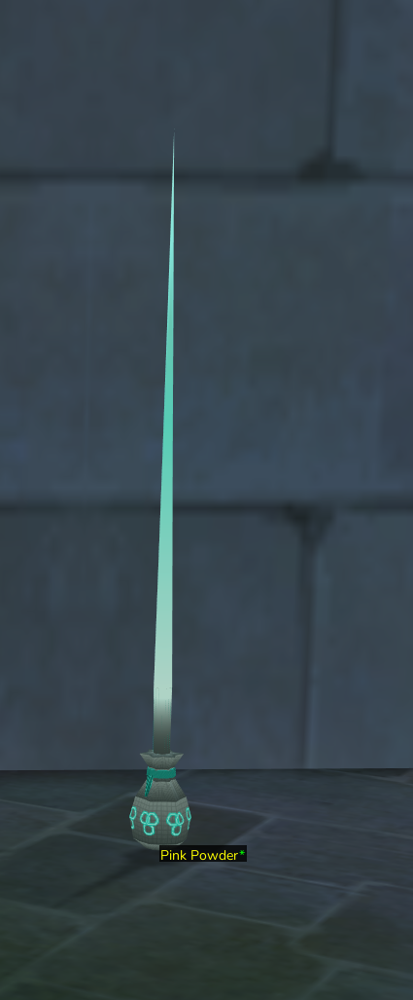 | 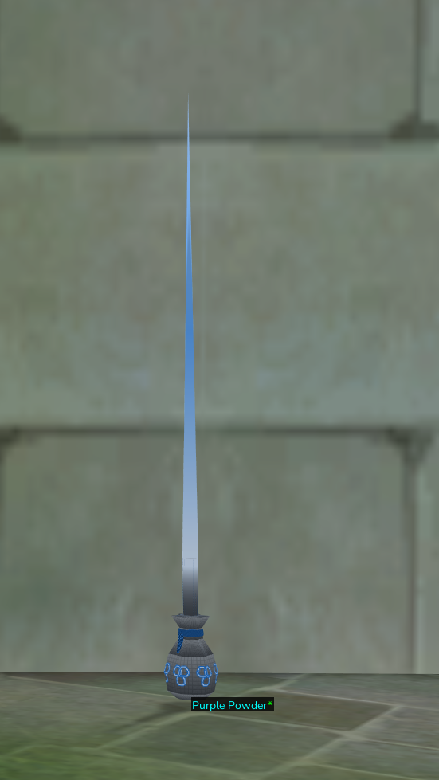 | 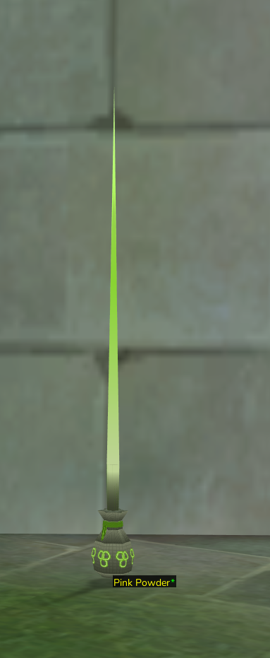 | 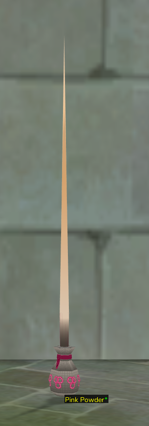 |

[Void](../../releases/latest/download/ROSE_DI68_Void.zip) ·
[Crimson](../../releases/latest/download/ROSE_DI68_Crimson.zip) ·
[Verdigris](../../releases/latest/download/ROSE_DI68_Verdigris.zip) ·
[Moldie](../../releases/latest/download/ROSE_DI68_Moldie.zip) ·
[Lime](../../releases/latest/download/ROSE_DI68_Lime.zip) ·
[Linen](../../releases/latest/download/ROSE_DI68_Linen.zip)

---

## Community Window

Your Friends window with three extra tabs. The friend and ignore lists are the game's own,
untouched — the rest is new.

| Notes | Checklist | Symbols |
|---|---|---|
| 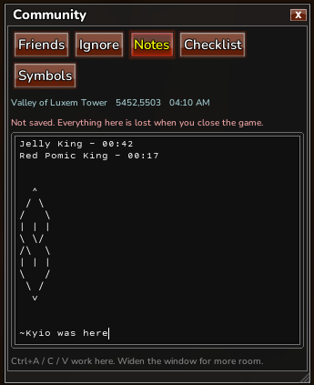 | 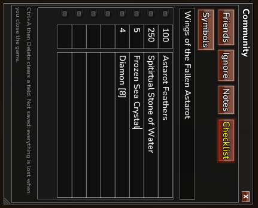 | 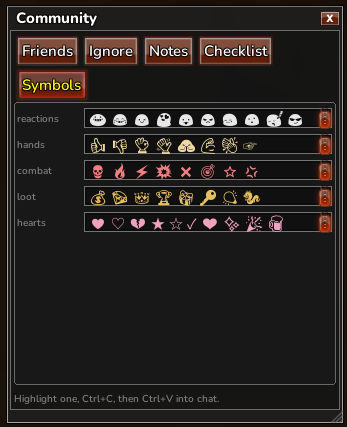 |

- **Notes** — a notepad. Also shows your zone, coordinates and server time.
- **Checklist** — eight tick-boxes, each with a quantity and a label. Use it for whatever you
  like: a farming run, a crafting list, a set you're collecting.
- **Symbols** — emoji you can copy and paste into chat.

Notes and Checklist keep what you type for as long as the client is running. Close the window,
reopen it, and it's still there. **It is not saved to disk** — everything clears when you close
the game.

One plain text file. Open it in Notepad and read it if you like; there's nothing else in the pack.

**Download:** [Community Window](../../releases/latest/download/ROSE_UI_CommunityWindow.zip)

---

## Installing

1. Close ROSE completely.
2. Copy the folders from the zip into your ROSE Online install folder, letting them merge.
   Usually `C:\Program Files\ROSE Online`.
3. Start the game.

Windows will ask you to confirm replacing files — that's expected, and you may get an
administrator prompt.

Only one UI theme at a time, and one color per drop group at a time. To switch, install
another straight over the top. Every pack in a family ships an identical file list, so nothing
gets left behind.

Drop groups are independent of each other and of the UI themes — there is no wrong combination.

## Uninstalling

**Delete the files you copied in.** That's the whole process.

ROSE loads loose files on disk in preference to its packed archives, so installing these does
not modify or replace any original game data — it sits on top of it, and removing it falls
straight back to stock. Every pack contains a `FILE_LIST.txt` naming every file it installs,
so you always know exactly what to remove.

The original artwork lives inside the game's own packed archives and is never modified, so
deleting the files is a complete return to stock.

---

## Is this safe?

Fair question to ask of any mod. Here's what's checkable rather than just claimed:

- **There is no installer and no executable.** Every pack contains only `.dds` textures,
  `.zms` mesh geometry, `.cur` cursors, `.css` and `.html` (plain text you can open and read),
  and `.txt` readmes. No `.exe`, no `.dll`, no scripts. Nothing in these archives can run.
- **Everything is browsable right here.** The `packs/` folder in this repository is the exact
  contents of every download, unpacked. You can look before you download.
- **SHA-256 checksums** for every zip are in [CHECKSUMS.txt](CHECKSUMS.txt), with instructions
  for verifying them.
- **Uninstall is deleting files.** No uninstaller to trust, no registry, no leftovers.
- **Client-side only.** Nothing communicates with anything. No server-side component exists.

---

## Terms

Free to use. Please don't sell it or repackage it as your own. Credit is appreciated but not
required.

These are recolors of ROSE Online's own artwork, plus original work by me. All rights in the
underlying game assets belong to their owners; this is a fan modification, offered in the hope
it's useful and with no claim over anything that isn't mine.

## Known limits

Fonts, particle effects, nameplate health bars, and character-sheet stat numbers are
engine-side and can't be changed by a mod. They stay stock in every theme.

## Notes

Some windows cache their artwork. If part of the interface still looks unchanged after
installing, close and reopen that window, or restart the client.
