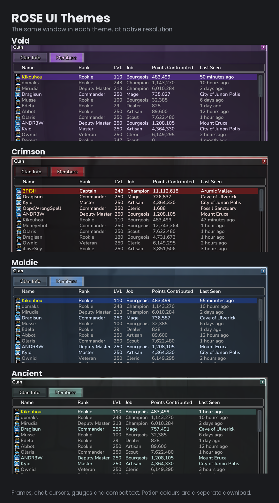
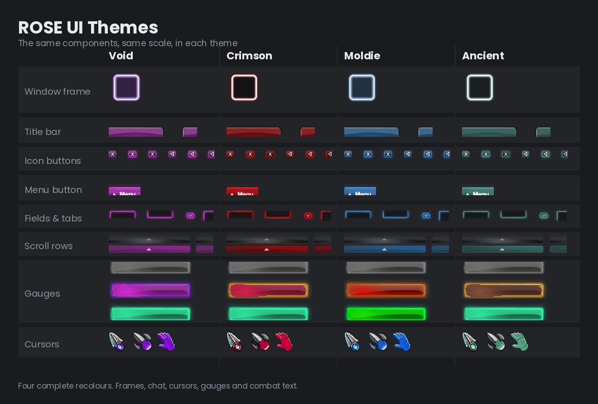
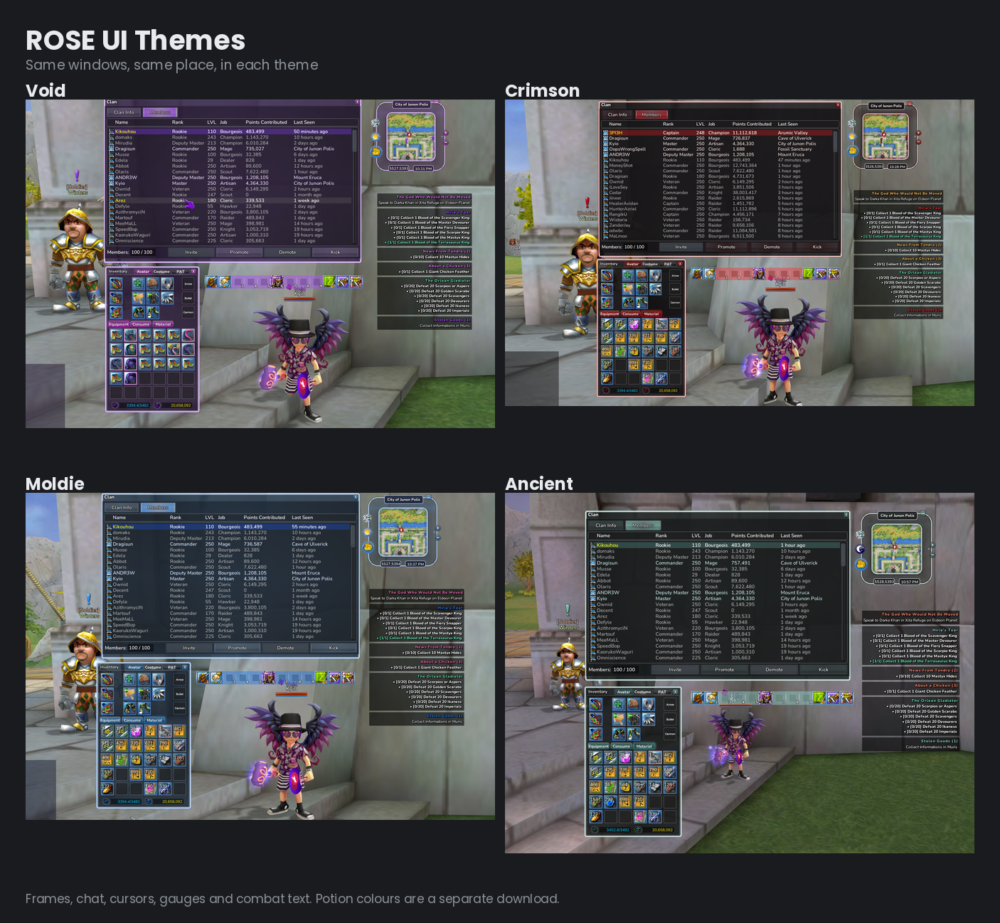
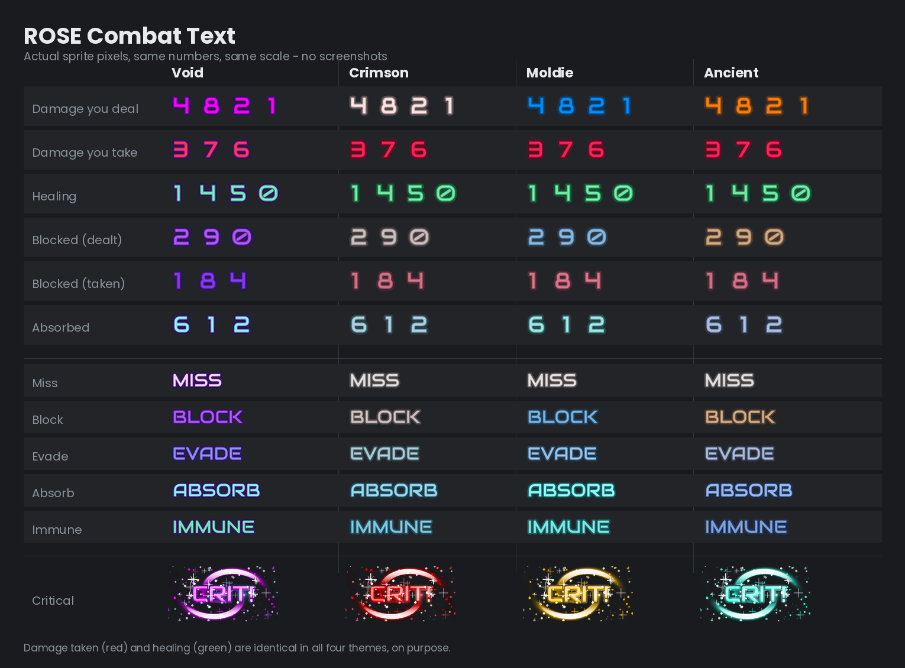
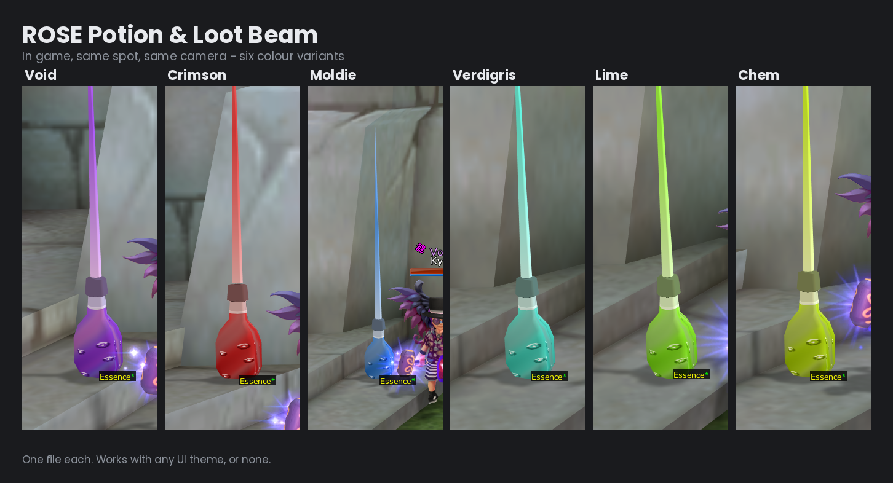
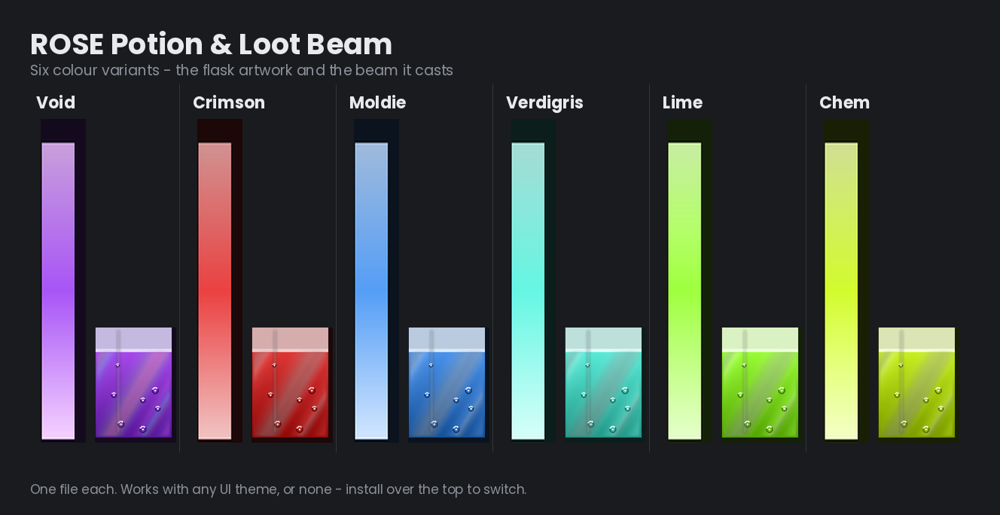

# ROSE Online — Cosmetic Mods

Client-side cosmetic mods for ROSE Online. Interface recolours, combat text, and potion
colours. **Nothing here touches the server, your account, or any game logic.**

---

## UI Themes

Four complete interface recolours — window frames, buttons, tabs, chat box, minimap ring,
cursors, gauges, and combat text.

| Theme | Look |
|---|---|
| **Void** | purple and violet chrome, magenta clan accent — the original |
| **Crimson** | near-black glass, deep blood-red glow, bone-white rim, amber alerts |
| **Moldie** | royal blue chrome, hat-gold highlights |
| **Ancient** | slate verdigris chrome, copper highlights, clay and steel gauges |

Component breakdown, and all four in game

**Download:**
[Void](../../releases/latest/download/ROSE_UI_Void.zip) ·
[Crimson](../../releases/latest/download/ROSE_UI_Crimson.zip) ·
[Moldie](../../releases/latest/download/ROSE_UI_Moldie.zip) ·
[Ancient](../../releases/latest/download/ROSE_UI_Ancient.zip)

Potion colours are **not** included in the theme packs — they're separate below, so you can
mix and match rather than having a colour forced on you.

---

## Combat Text (standalone)

Just the floating combat numbers, for anyone who wants a clearer damage readout without
changing their whole interface. 13 files.

**Download:**
[Void](../../releases/latest/download/ROSE_CombatText_Void.zip) ·
[Crimson](../../releases/latest/download/ROSE_CombatText_Crimson.zip) ·
[Moldie](../../releases/latest/download/ROSE_CombatText_Moldie.zip) ·
[Ancient](../../releases/latest/download/ROSE_CombatText_Ancient.zip)

Damage types are told apart by colour, so each one is assigned rather than everything being
tinted the same way:

- **damage you deal** — the theme's colour
- **damage you take** — red
- **healing** — green
- **critical hits** — matches the theme's glow
- **blocked / absorbed** — muted variants
- **miss** — neutral grey

In **Crimson, Moldie and Ancient**, damage taken and healing are **identical** — they never
change between themes, so you don't have to relearn your own combat log when you switch.

**Void is the exception.** It was made before I settled on that rule, so its whole set sits in
the violet/magenta family — healing reads blue, received damage reads magenta. It suits the
Void interface, but if you want the clearest readout, one of the other three is the better
pick.

*Already running a full UI theme? You don't need this — the combat text is included in it.*

---

## Potion & Loot Beam

Recolours of the potion flask and the light beam it casts. Two files each — the recoloured
texture, and the beam mesh, which is my own work built from scratch. Works with any UI theme,
or with none.

The flask and beam artwork on its own

**Download:**
[Void](../../releases/latest/download/ROSE_Potion_Void.zip) ·
[Crimson](../../releases/latest/download/ROSE_Potion_Crimson.zip) ·
[Moldie](../../releases/latest/download/ROSE_Potion_Moldie.zip) ·
[Verdigris](../../releases/latest/download/ROSE_Potion_Verdigris.zip) ·
[Lime](../../releases/latest/download/ROSE_Potion_Lime.zip) ·
[Chem](../../releases/latest/download/ROSE_Potion_Chem.zip)

---

## Installing

1. Close ROSE completely.
2. Copy the folders from the zip into your ROSE Online install folder, letting them merge.
   Usually `C:\Program Files\ROSE Online`.
3. Start the game.

Windows will ask you to confirm replacing files — that's expected, and you may get an
administrator prompt.

Only one UI theme, and one potion colour, at a time. To switch, install another straight over
the top. Every theme ships an identical file list, so nothing gets left behind.

## Uninstalling

**Delete the files you copied in.** That's the whole process.

ROSE loads loose files on disk in preference to its packed archives, so installing these does
not modify or replace any original game data — it sits on top of it, and removing it falls
straight back to stock. Every pack contains a `FILE_LIST.txt` naming every file it installs,
so you always know exactly what to remove.

The original artwork lives inside the game's own packed archives and is never modified, so
deleting the files is a complete return to stock.

---

## Is this safe?

Fair question to ask of any mod. Here's what's checkable rather than just claimed:

- **There is no installer and no executable.** Every pack contains only `.dds` textures,
  `.zms` mesh geometry, `.cur` cursors, `.css` and `.html` (plain text you can open and read),
  and `.txt` readmes. No `.exe`, no `.dll`, no scripts. Nothing in these archives can run.
- **Everything is browsable right here.** The `packs/` folder in this repository is the exact
  contents of every download, unpacked. You can look before you download.
- **SHA-256 checksums** for every zip are in [CHECKSUMS.txt](CHECKSUMS.txt), with instructions
  for verifying them.
- **Uninstall is deleting files.** No uninstaller to trust, no registry, no leftovers.
- **Client-side only.** Nothing communicates with anything. No server-side component exists.

---

## Terms

Free to use. Please don't sell it or repackage it as your own. Credit is appreciated but not
required.

These are recolours of ROSE Online's own artwork, plus original work by me. All rights in the
underlying game assets belong to their owners; this is a fan modification, offered in the hope
it's useful and with no claim over anything that isn't mine.

## Known limits

Fonts, particle effects, nameplate health bars, and character-sheet stat numbers are
engine-side and can't be changed by a mod. They stay stock in every theme.

## Notes

Some windows cache their artwork. If part of the interface still looks unchanged after
installing, close and reopen that window, or restart the client.
