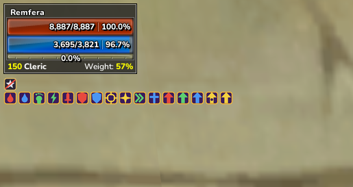
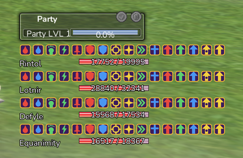

# Buff Icons

Sixteen buff icons, coloured by the class that casts them — Soldier red, Hawker
green, Dealer yellow, Muse blue.

The colour is the point. Four people's buffs stacked in a party list is where
you actually need to see who is missing what, and a column of same-coloured
plates tells you nothing.

[Download](../../releases/latest/download/ROSE_Buff_Icons.zip)

**Read this before installing a second icon pack.** They are all one shared
sheet — `3ddata\control\Res\stateicon.dds` — rather than separate images, and
that same sheet also carries quest log icons and minimap markers. So two icon
packs can never be combined: whichever is installed last replaces the whole
thing, including the parts the other one was changing.

Slots that were not designed for are left as plain outlined stars rather than
empty plates, so they read as neutral markers instead of buffs that are not
there.
