# Spooky Halloween

A seasonal set: the interface, the effects and the drops, decorated for the season.
Install the whole thing, or only the parts you want.

**[The forum thread](https://forum.roseonlinegame.com/topic/7798-spooky-ui-combat-text-and-other-halloween-themed-fun/)** ·
**[everything in one download](../../releases/latest/download/Halloween_COMPLETE.zip)**

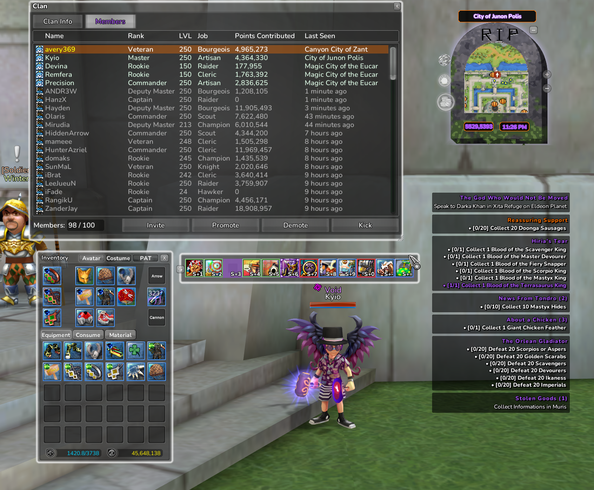

## The interface

| | |
|---|---|
| 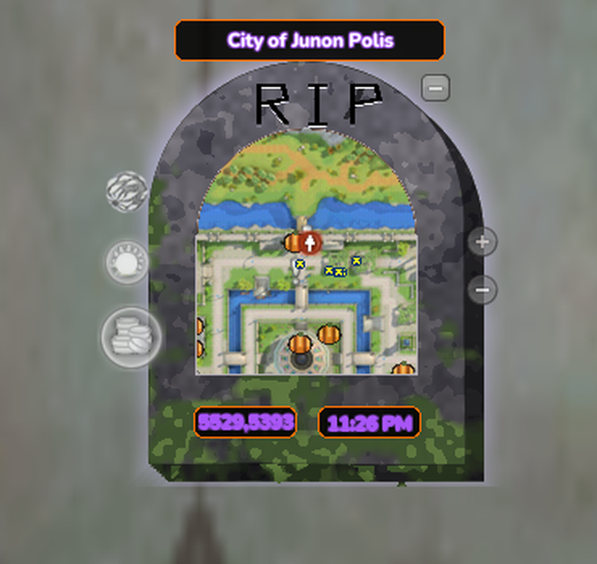 | **Spooky UI** — a ghostly theme with Halloween accents, its own cursors, and the haunted tombstone around the minimap. Something lives on the stone.  [Spooky UI](../../releases/latest/download/Halloween_SpookyUI.zip) · [just the minimap](../../releases/latest/download/Halloween_SpookyMinimap.zip) |

### The summon gauge

Free slots at a glance, health for each summon, a warning when one is nearly dead,
and an out-of-range state.

| Resting | Full | Low health | Out of range |
|---|---|---|---|
| 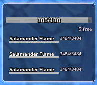 | 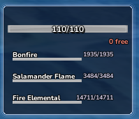 | 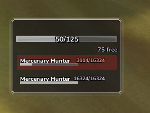 | 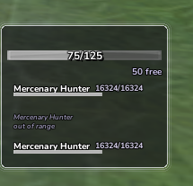 |

[Download the summon gauge](../../releases/latest/download/Halloween_SpookySummonGauge.zip)

### Buff icons

One colour for every class, with a few seasonal treats to find.

| On your bar | In a party |
|---|---|
| 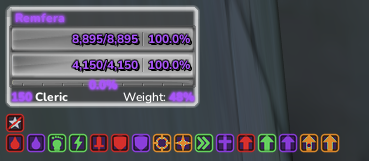 | 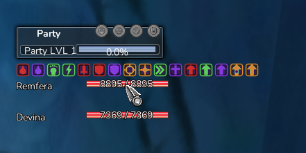 |

[Download the buff icons](../../releases/latest/download/Halloween_SpookyBuffIcons.zip)

## Combat text

Damage numbers in six colours, the words, status pop-ups — and a flock of bats on
every critical hit.

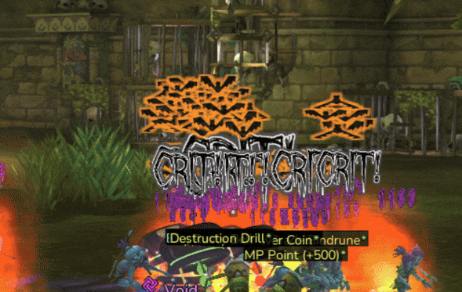

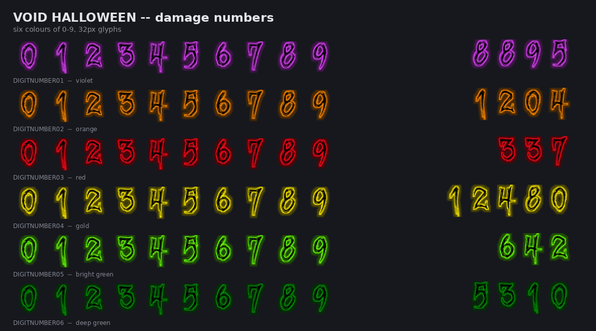

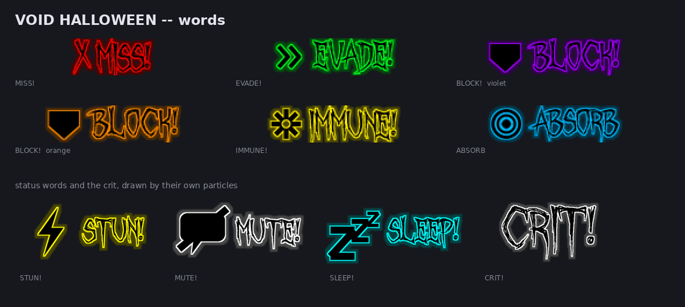

[Download the combat text](../../releases/latest/download/Halloween_SpookyCombatText.zip)

## Witches cauldrons

Loot beams as bubbling cauldrons, six colours across every drop group.

| | | |
|---|---|---|
| 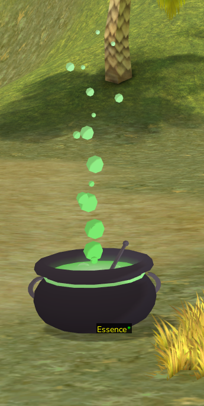 | 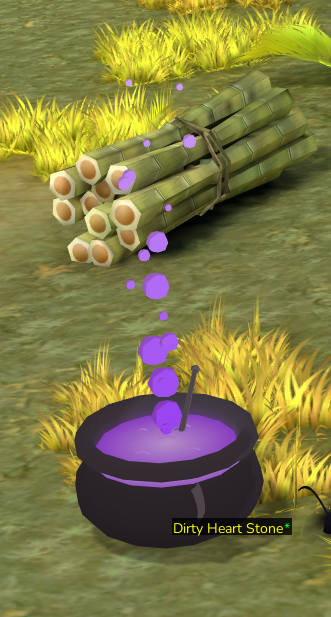 | 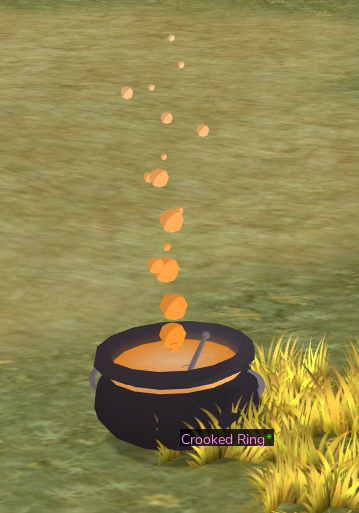 |
| 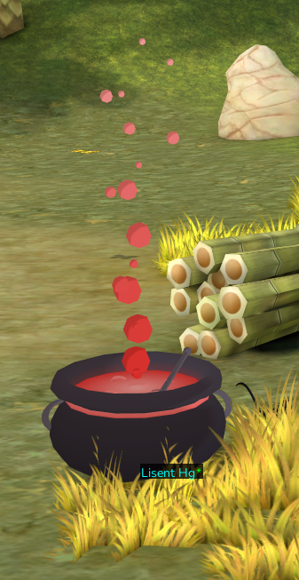 | 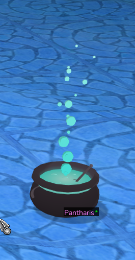 | 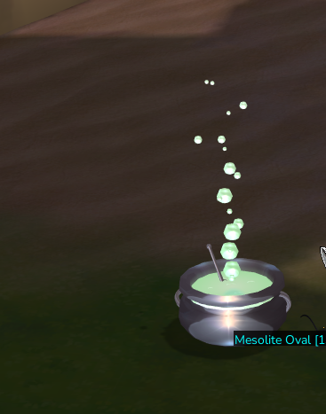 |

[Download the cauldrons](../../releases/latest/download/Halloween_SpookyWitchesCauldrons.zip)

## Summon auras

A haunting aurora with wisps swirling inside, around every summon — anchored at the
ground, so it suits a bonfire and a dragon alike.

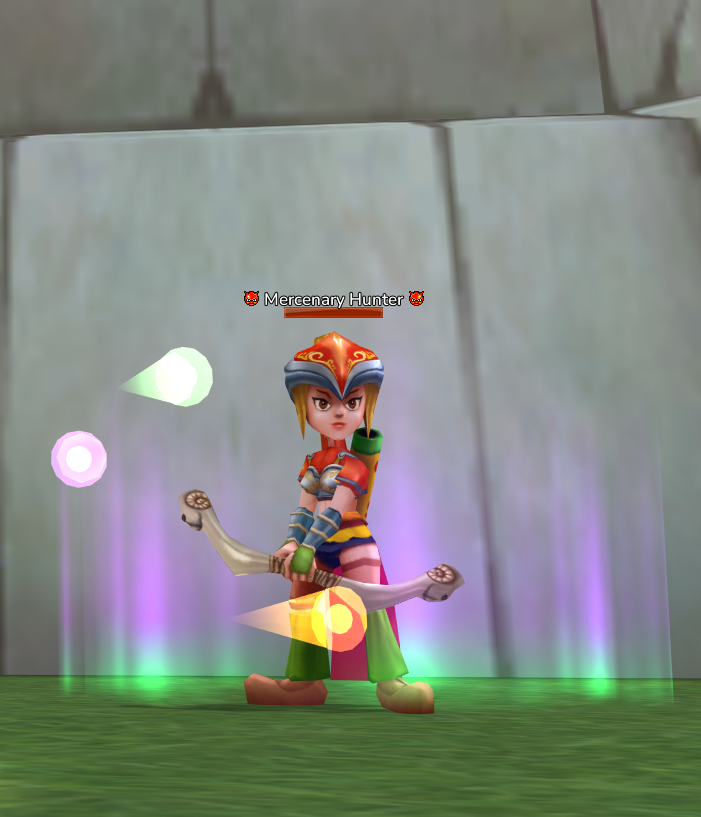

[Download the summon auras](../../releases/latest/download/Halloween_SpookySummonAuras.zip)

## The buffs

Nine effects, each with its own silhouette so you can read them at a glance.

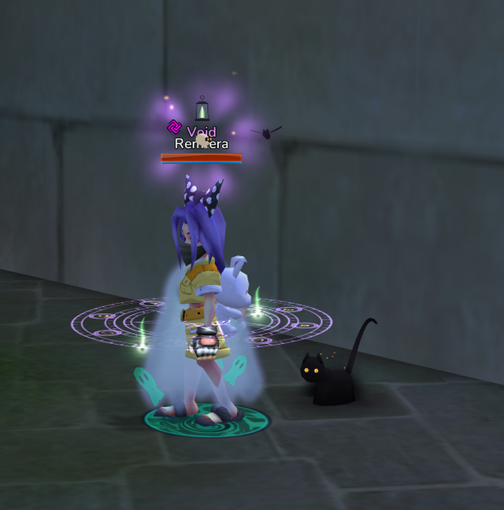

**[All nine in one pack](../../releases/latest/download/Halloween_SpookyBuffs_All.zip)**, or one at a time:

| | Buff | |
|---|---|---|
| 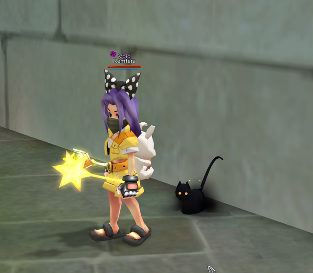 | **Move speed — Summon Familiar** A protective feline at your side, watching your back. | [download](../../releases/latest/download/Halloween_SpookyBuff_MoveSpeed.zip) |
| 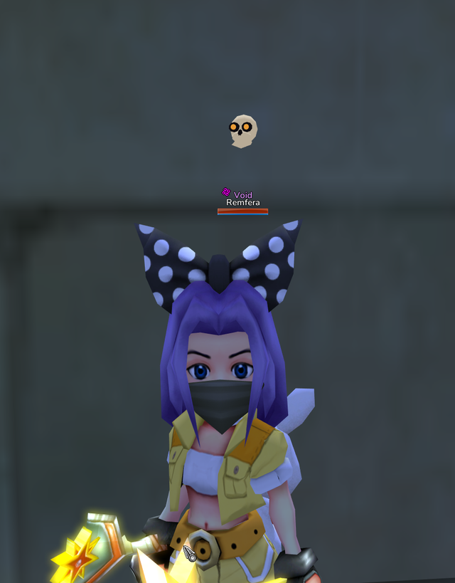 | **Attack power — Spooky Skull** A skull appears, oddly emboldening. | [download](../../releases/latest/download/Halloween_SpookyBuff_Attack.zip) |
| 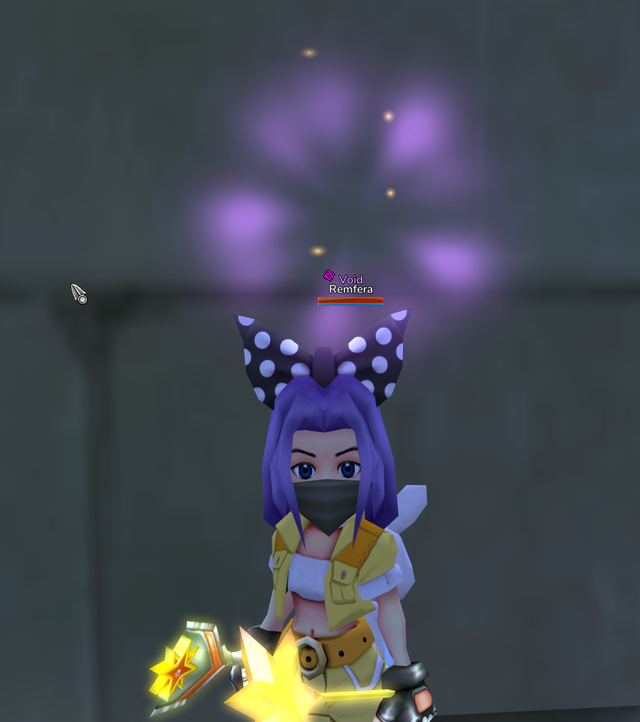 | **Critical — Halloween Aura** Purple radiance with orange wisps rising within. | [download](../../releases/latest/download/Halloween_SpookyBuff_Critical.zip) |
| 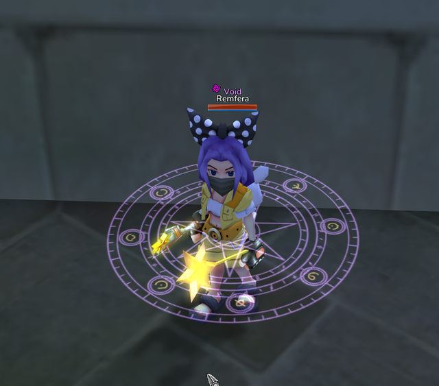 | **Defence — Magic Sigil** An esoteric circle to dampen oncoming blows. | [download](../../releases/latest/download/Halloween_SpookyBuff_Defense.zip) |
| 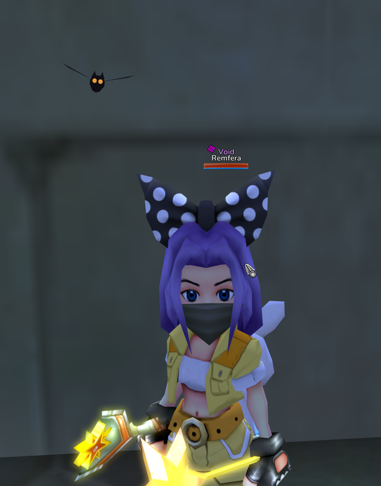 | **Accuracy — Bat Familiar** Echo-locating your enemies for you. | [download](../../releases/latest/download/Halloween_SpookyBuff_Accuracy.zip) |
| 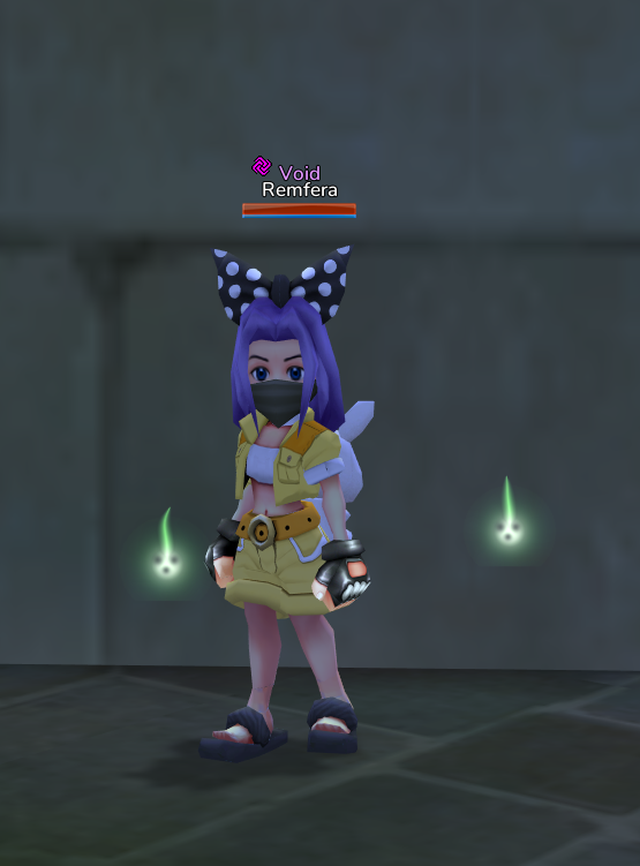 | **Attack speed — Will-o-Wisps** Haunting wisps, strangely energizing. | [download](../../releases/latest/download/Halloween_SpookyBuff_AttackSpeed.zip) |
| 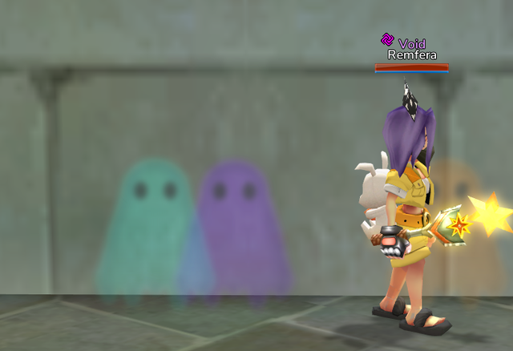 | **Dodge — Ghostly After-Images** Curious beings haunting your wake. | [download](../../releases/latest/download/Halloween_SpookyBuff_Dodge.zip) |
| 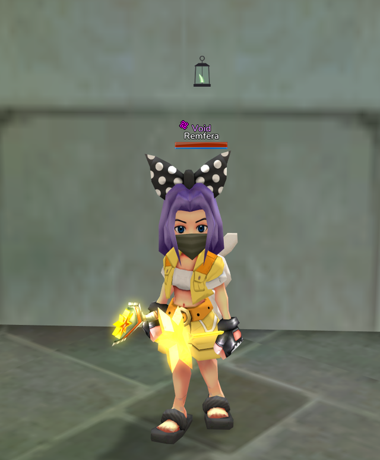 | **Magic defence — Soul Lantern** Your soul's flame, warding away unwanted magics. | [download](../../releases/latest/download/Halloween_SpookyBuff_MagicDefense.zip) |
| 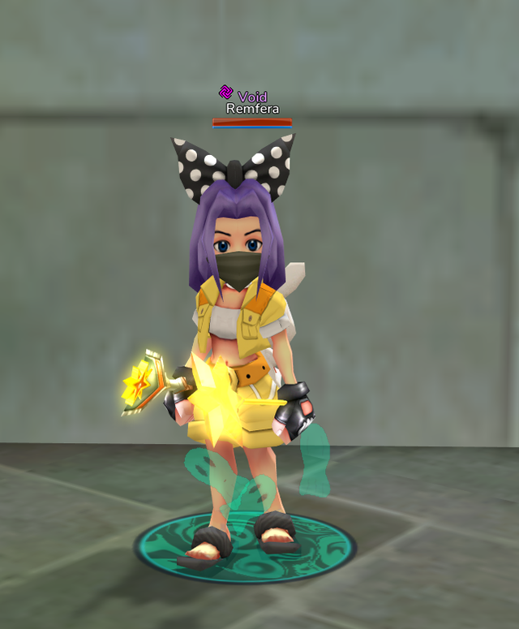 | **Damage — Well of Souls** Souls rising, lending you their strength. | [download](../../releases/latest/download/Halloween_SpookyBuff_Damage.zip) |

## Installing

Exactly as everything else here — see [Installing](installing.md). Only one UI theme at a
time, and one colour per drop group; install another straight over the top to switch.
